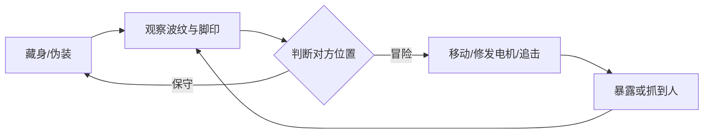
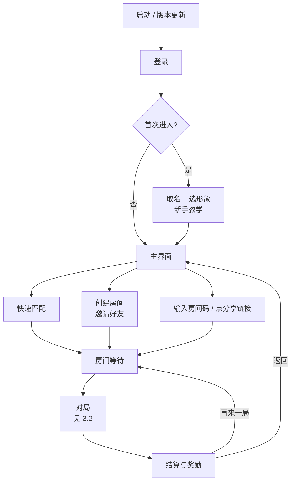
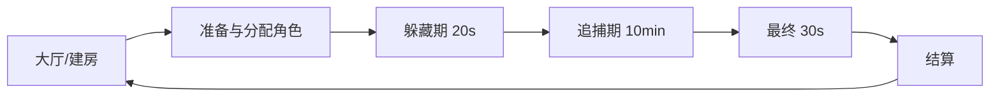
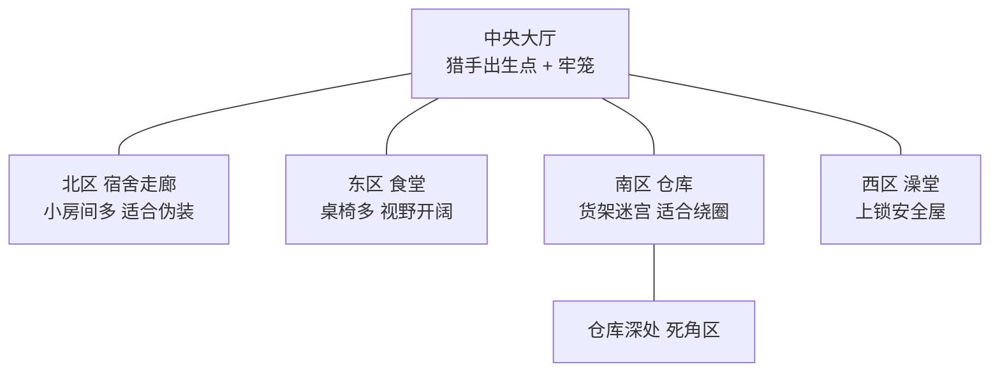
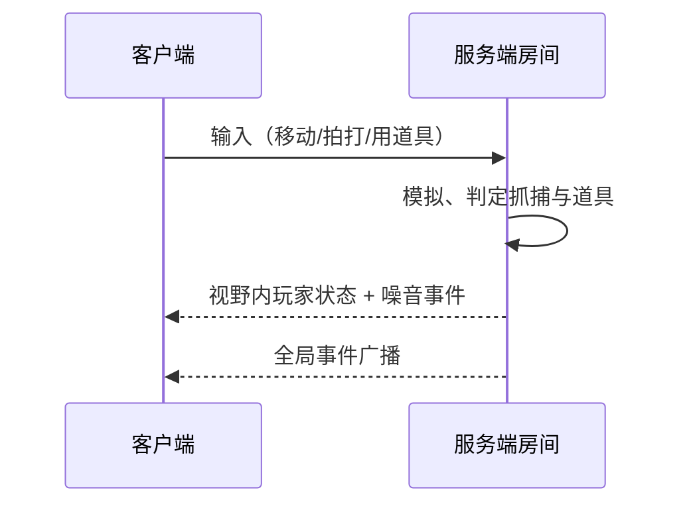

# 《熄灯》策划案

Sep 24, 2026 · @Alison Ande

## 1. 游戏概述

《熄灯》是一款 2D 俯视角多人非对称躲猫猫游戏：1～2 名猎手在黑暗的建筑里追捕 6～10 名藏者，藏者存活到时间结束即获胜，每局默认 10 分钟。

| 项目 | 内容 |
| --- | --- |
| 类型 | 多人非对称对抗 / 躲猫猫 / 派对 |
| 视角 | 2D 俯视角，镜头跟随 |
| 人数 | 8～12 人一个房间（猎手 1～2，藏者 6～10） |
| 单局时长 | 追捕默认 10 分钟（房主可选 5 / 8 / 10 分钟），含准备与结算约 11 分钟 |
| 平台 | 手机首发（iOS / Android，横屏），后续可出 PC 版 |
| 目标用户 | 喜欢派对游戏、和朋友开黑的玩家 |

**核心体验关键词**：看不见的紧张、被发现瞬间的心跳、翻盘的混乱。

**设计支柱**

1. **黑暗即规则**：视野受限是所有紧张感的来源，双方都在信息不全的情况下博弈。
2. **行动有代价**：跑、修、开门都会暴露自己，安全和目标永远冲突。
3. **节奏被打断**：每 60 秒一次全局事件，局势不会固化。
4. **出局不下线**：被抓者变幽灵继续参与，没人挂机。

5) **静音也能玩**：所有声音都有同步的视觉表现（波纹、屏幕边缘脉动、图标），关掉声音不丢失任何信息，声音只负责加强氛围。

## 2. 核心玩法

核心循环是「藏 → 听 → 赌 → 逃/抓」：双方都看不清对方，只能靠声音波纹和痕迹推测位置，再决定冒险还是保守。



### 2.1 视野系统

- 每个玩家只能看到自身周围的光圈，墙体遮挡视线，墙后区域全黑
- 视线用 2D 射线投射计算阴影，看不到的区域不渲染其他玩家
- 光源：个人光圈、猎手手电（扇形光锥）、场景中固定的少量灯、事件触发的应急灯

### 2.2 声音波纹

- 所有噪音以扩散波纹的形式画在地图上，视野外也能看到波纹，但看不到人
- 波纹大小 = 噪音大小：走路无波纹，跑步小圈，开门中圈，撞翻物件/修发电机大圈
- 猎手和藏者都能看到所有波纹，这是双方获取信息的主要手段

每个波纹都同时播放对应的方位音效（左右声道 + 距离衰减），声音和波纹是同一个事件的两种表现：开声音的玩家可以「听位置」，静音的玩家看波纹得到同样的信息。

### 2.3 痕迹

- 藏者跑动会留下脚印，持续 3 秒后淡出
- 猎手可以顺着脚印追踪，藏者可以故意跑一段再切换走路来误导

### 2.4 伪装

- 藏者在伪装点附近按键，选择一个当前房间存在的物件外形（纸箱、椅子、盆栽等）
- 伪装期间不能移动，按移动键即解除伪装，解除时有 0.5 秒动作
- 伪装的物件有细微破绽（影子方向略偏、每 10 秒轻微抖动一次），给猎手留线索

### 2.5 抓捕

- 猎手点击拍打按钮抓捕，范围内自动吸附最近的目标，抓中后藏者转为幽灵；单纯碰撞不会抓人，避免手机上误触，也让猎手可以主动放过卧底
- 猎手可以「拍打」伪装物：打中藏者 = 抓获；打错 = 猎手硬直 1.5 秒并发出大波纹
- 抓捕判定由服务端执行，避免延迟争议

### 2.6 可破坏与可搭建的墙体

地图不是固定的：墙可以被打破、也可以临时搭起来，双方都能改变地形来开路、堵路和改变视线。

- **墙体分两种**：外墙和承重墙不可破坏；室内隔断墙可破坏，外观上有裂纹，玩家一眼能分辨
- **破墙**：打破后留下碎石地面，永久打通，视线和通路同时打开；破墙发出大波纹
- **搭墙**：临时墙可以堵门、堵走廊、切断视线，有耐久，到时间自动消失或被打破
- **视野联动**：墙体变化实时影响视线遮挡，破一面墙可能让藏好的人突然暴露在光里
- **后期效果**：隔断墙被逐渐打穿，地图越来越开阔，10 分钟长局的后半段自然对猎手更有利，形成节奏递进

## 3. 完整游戏流程

### 3.1 外围总流程

从打开游戏到一局结束再回来，玩家最快 3 步就能进局：打开 → 快速匹配 → 开始。



| 环节 | 内容 |
| --- | --- |
| 启动 | 闪屏 → 版本检查与资源热更新 → 公告 |
| 登录 | 国内版：微信 / QQ / 手机号；海外版：Apple / Google；都支持游客登录，之后可绑定 |
| 首次进入 | 取昵称、选初始形象；新手教学约 3 分钟，和 AI 各打一段藏者和猎手，学会摇杆、伪装、拍打、用道具 |
| 主界面 | 中间是自己的角色，按钮：快速匹配（最大）、创建房间、加入房间、好友、衣柜、商店、战绩、任务、设置 |
| 快速匹配 | 系统按延迟和段位凑满 8～12 人，匹配超过 60 秒可选择用 AI 补位开局；可和好友组队（最多 4 人）一起匹配 |
| 创建房间 | 房主设置地图、时长（5 / 8 / 10 分钟）、猎手人数、是否开启卧底、是否开近距离语音、人数不足是否 AI 补位 |
| 邀请好友 | 三种方式：游戏内好友列表一键邀请；6 位房间码；分享链接到微信 / QQ，好友点链接直接拉起游戏进房 |
| 房间等待 | 显示玩家列表和准备状态；等待时可在小练习场里走动、试伪装；全员准备或房主点开始即进局 |
| 对局 | 加载 → 角色分配 → 躲藏期 → 追捕期 → 最终 30 秒（见 3.2） |
| 结算与奖励 | 胜负、个人得分、MVP、名场面 → 发放经验、金币、任务进度、段位分 |
| 结算后 | 「再来一局」：同一房间、同一批人直接进下一局；「返回主界面」；「分享名场面」到社交平台 |

**规则补充**

- 组队的好友之间不会抽出卧底，防止场外开黑串通
- 快速匹配中途退出扣信誉分，信誉低的玩家匹配变慢；私人房间不扣
- 掉线 30 秒内重开游戏直接回到对局

### 3.2 单局流程

一局从进房到结算约 11 分钟（按默认 10 分钟追捕计），分为 6 个阶段。



| 阶段 | 时长 | 发生什么 |
| --- | --- | --- |
| 大厅 | 不限 | 创建/加入房间（房间码或快速匹配），选皮肤，房主选地图与规则，全员准备后开始 |
| 角色分配 | 5 秒 | 随机抽取猎手和卧底（上局猎手本局不再当），卧底身份只有卧底本人和猎手可见，屏幕展示身份与地图俯瞰 |
| 躲藏期 | 20 秒 | 猎手被锁在出生房间，屏幕全黑只听声音；藏者分散、找藏点、捡道具 |
| 追捕期 | 9 分 30 秒（默认） | 猎手出门追捕；每 60 秒触发一次周期事件；藏者可修发电机缩短剩余时间 |
| 最终 30 秒 | 30 秒 | 猎手永久加速、藏者心跳波纹外放、BGM 变急，全场追逐收尾 |
| 结算 | 15 秒 | 展示胜负、个人得分、MVP、名场面回放（被抓瞬间），返回房间 |

**提前结束条件**

- 所有藏者被抓 → 猎手胜，立即结算
- 每修好 1 台发电机，剩余时间减少 60 秒，3 台全修好最多提前 3 分钟结束
- 猎手全部掉线 → 本局作废，不计分

## 4. 角色设计

三种身份：猎手负责抓，藏者负责活下来或逃脱，幽灵是被抓后的藏者，继续影响战局。

### 4.1 藏者

- **目标**：存活到时间结束（默认 10 分钟）；修发电机可以缩短剩余时间
- **移动**：走路（无波纹、慢）/ 跑步（快、留脚印、小波纹），体力条限制跑步时长
- **能力**：伪装成物件；修发电机（需站在旁边持续按键，会持续发出大波纹）；拾取并使用道具，最多携带 2 个
- **救援**：藏者可以在猎手的「牢笼」处解救被抓的队友（需 3 秒读条，有风险），被救者从幽灵恢复为藏者，每人只能被救 1 次

### 4.2 猎手

- **目标**：在时间内抓完所有藏者
- **移动**：比藏者走路快，比藏者跑步略慢，但没有体力限制
- **能力**：拍打（近战判定，可打伪装物）；手电（常驻，扇形光锥，可开关，开着会让自己在远处也可见）；拾取猎手道具，最多携带 2 个
- **平衡机制**：每抓一人，视野光圈缩小 5%（防滚雪球）；被抓者会被送到地图中央的牢笼

### 4.3 幽灵

- 被抓的藏者变为幽灵，半透明，可穿墙，不能被猎手看到
- 出局瞬间选择阵营：
  - **守护灵**：每 30 秒可以在一个位置制造一次假波纹，帮藏者误导猎手
  - **怨灵**：每 30 秒可以标记一个藏者 2 秒，让猎手看到（出卖队友，获得猎手阵营分）
- 被救回后幽灵身份取消，阵营选择作废

### 4.4 卧底

卧底混在藏者里，外观和操作与藏者完全一样，暗中属于猎手阵营：一边假装躲藏，一边偷偷给猎手报点。

- **身份**：10 人及以上房间从藏者中抽 1 名卧底；卧底和猎手互相知道身份，其他藏者不知道
- **报点**：选中视野内一名藏者或一个位置，猎手屏幕上出现 3 秒标记；冷却 40 秒
- **破绽**：报点时卧底头顶会闪一次极淡的光点（1 秒，只有 3 格内的玩家能看到），被旁边的藏者撞见就可能暴露
- **抓不抓由猎手决定**：猎手对卧底点拍打照常能抓，不点就不抓。不抓能保住眼线，但「猎手从某人身边经过却没抓」会被藏者当成线索；抓了能洗清卧底嫌疑，还能把卧底当诱饵：
  - 被抓的卧底和普通藏者一样进牢笼，身份不公开，其他藏者来救时猎手可以蹲守
  - 在牢笼或幽灵状态下仍可报点，但冷却延长到 60 秒
  - 被藏者救出后恢复卧底身份，继续潜伏
  - 抓卧底不给猎手加分；猎手的「抓完所有藏者」胜利条件不要求抓到卧底
- **捣乱**：可以参与修发电机，但会偷偷让进度倒退（每秒 -1%，进度条上看不出来，只有修得明显变慢）
- **指认**：藏者站在嫌疑人 2 格内按住指认键 2 秒：
  - 指认正确：卧底身份全图公开，卧底被淘汰，指认者加分
  - 指认错误：指认者的位置向猎手暴露 5 秒，每人每局只能指认 1 次
- **胜负**：卧底跟随猎手阵营胜负；存活到结束且未被指认有额外加分

卧底让藏者之间也产生怀疑：抱团躲更安全，但可能身边就是内鬼。

**猎手人数**：8～9 人局 1 名猎手，10～12 人局 2 名猎手，另从藏者中抽 1 名卧底。

## 5. 道具系统

道具分猎手和藏者两套，从地图里的道具箱拾取，每人最多携带 2 个，所有道具都只能使用 1 次，用完即消失。

**刷新规则**

- **定时掉落**：追捕期每 60 秒全图掉落一轮道具，每轮 3～4 个，落在随机位置
- **落点预告**：掉落前 5 秒，落点在全图显示光柱，猎手和藏者都能看到，形成争抢：藏者冒险去捡可能撞上猎手，猎手守着落点可能被调虎离山
- 开局在固定道具点预先放 6 个普通道具，之后只靠定时掉落补充
- 道具箱外观相同，打开前不知道是什么；拾到对方阵营的道具会自动转换为本阵营的同品质道具
- 道具箱落地和打开都会发出中波纹

### 5.1 猎手道具

| 道具 | 效果 | 数值 | 稀有度 |
| --- | --- | --- | --- |
| 强光手电 | 向前方照出长光柱，照到的藏者和伪装全部现形 | 长 8 格，现形 2 秒 | 普通 |
| 捕网 | 投掷物，命中藏者后减速 | 射程 6 格，减速 60% 持续 3 秒 | 普通 |
| 铃铛陷阱 | 放在地上，藏者踩中后全图响铃并显示位置 | 显示 3 秒，放置 1 个 | 普通 |
| 心跳雷达 | 显示最近一个藏者的方向箭头 | 持续 5 秒 | 稀有 |
| 冲刺鞋 | 短时间大幅加速 | 移速 +60% 持续 4 秒 | 稀有 |
| 封门钉 | 封死一扇门，藏者无法通过 | 持续 20 秒 | 稀有 |
| 定位追踪器 | 锁定最近 1 名藏者，在猎手地图上持续显示其实时位置 | 持续 6 秒，被追踪者屏幕边缘闪红提示 | 稀有 |
| 全员扫描 | 全图显示所有藏者位置（伪装中的也显示） | 显示 2 秒 | 传说 |
| 破墙锤 | 砸穿前方一段隔断墙或临时墙，开出捷径 | 蓄力 1 秒，破坏 1×2 格 | 普通 |
| 铁栅栏 | 放置一道栅栏，藏者无法通过，但不挡视线 | 长 3 格，持续 20 秒，藏者拍 5 下可破 | 稀有 |

### 5.2 藏者道具

| 道具 | 效果 | 数值 | 稀有度 |
| --- | --- | --- | --- |
| 烟雾弹 | 原地释放烟雾，猎手进入后视野归零 | 半径 3 格，持续 6 秒 | 普通 |
| 假身 | 在原地留下一个自己的替身，本人隐身 | 替身存在 8 秒，隐身 2 秒 | 普通 |
| 香蕉皮 | 放在地上，猎手踩中滑倒 | 硬直 1.5 秒 | 普通 |
| 反光镜 | 被手电照到时自动反弹，猎手致盲 | 致盲 2 秒，一次性 | 稀有 |
| 能量饮料 | 回满体力并短时间跑步无消耗 | 持续 5 秒 | 稀有 |
| 万能钥匙 | 打开上锁房间（只有一个出口的安全屋） | 一次性 | 稀有 |
| 加速鞋 | 短时间大幅加速，跑步不耗体力 | 移速 +50% 持续 5 秒 | 普通 |
| 隐身斗篷 | 完全隐身，不留脚印，但跑步仍有波纹，被拍打或定位追踪仍生效 | 持续 6 秒 | 稀有 |
| 干扰器 | 使用后免疫猎手的定位追踪器和全员扫描，并在地图上生成 2 个假位置 | 持续 15 秒 | 传说 |
| 速建木板 | 在面前立起一道临时墙，堵门、堵路、挡视线 | 长 2 格，持续 25 秒，猎手拍 3 下可破 | 普通 |
| 小型炸药 | 炸开一段隔断墙，开出逃生通道；爆炸瞬间附近的猎手眩晕 | 引信 2 秒，破坏 2×2 格，眩晕 1 秒，超大波纹 | 稀有 |

**设计原则**：猎手道具偏「找」和「控」，藏者道具偏「躲」和「逃」；每个道具都有反制手段（如反光镜克强光手电，香蕉皮克冲刺鞋）。

## 6. 周期事件系统

追捕期每 60 秒随机触发一次全局事件，触发前 5 秒全屏预警（图标 + 倒计时 + 音效），一局约触发 9 次，同一事件一局最多出现 2 次。

| 事件 | 效果 | 持续 | 偏向 |
| --- | --- | --- | --- |
| 全楼停电 | 所有人视野缩到最小，只有猎手手电可用 | 10 秒 | 猎手 |
| 应急灯 | 全图亮起，所有伪装失效，所有人可见 | 8 秒 | 猎手 |
| 肾上腺素 | 全员移速 +50%，藏者跑步不耗体力 | 10 秒 | 中立 |
| 广播点名 | 随机暴露 1 名藏者位置，所有人可见 | 3 秒 | 猎手 |
| 迷雾 | 猎手视野减半，波纹显示延迟 1 秒 | 12 秒 | 藏者 |
| 锁门 | 地图一半的门关闭，逼藏者转移 | 15 秒 | 猎手 |
| 高级空投 | 下一轮定时掉落全部为稀有或传说道具 | 瞬时 | 中立 |
| 猎手迷失 | 猎手操控方向反转 | 5 秒 | 藏者 |

**权重规则**：局势失衡时自动调整事件权重。藏者存活率高于 70% 时提高偏猎手事件权重；低于 30% 时提高偏藏者事件权重。

**最终 30 秒（固定事件）**：猎手移速永久 +20%；所有藏者每 2 秒发出一次心跳波纹；BGM 切换为紧张版。

## 7. 胜负与计分

阵营胜负决定输赢，个人得分决定 MVP 和成长奖励，两者分开计算，保证输的一方也有个人高光。

**阵营胜负**

- 猎手胜：时间内抓完所有藏者
- 藏者胜：时间结束时至少 1 名藏者存活（关在牢笼里的不算）
- 卧底：随猎手阵营胜负，被指认后淘汰但阵营结果仍计入

**个人得分**

| 行为 | 阵营 | 得分 |
| --- | --- | --- |
| 存活到结束 | 藏者 | +100 |
| 每存活 1 分钟 | 藏者 | +15 |
| 修发电机（每台参与） | 藏者 | +40 |
| 解救队友 | 藏者 | +60 |
| 用道具让猎手失误（滑倒、致盲、扑空） | 藏者 | +20 |
| 抓到藏者 | 猎手 | +50 |
| 最后 30 秒内抓到藏者 | 猎手 | +80 |
| 守护灵的假波纹骗到猎手 | 幽灵 | +20 |
| 怨灵标记后该藏者被抓 | 幽灵 | +30（计入猎手阵营） |
| 报点后 10 秒内该藏者被抓 | 卧底 | +40 |
| 存活到结束且未被指认 | 卧底 | +120 |
| 成功指认卧底 | 藏者 | +80 |

**MVP**：全场个人得分最高者；猎手阵营和藏者阵营各评一个。

**结算展示**：胜负动画 → 个人得分明细 → MVP → 「名场面」（系统自动记录本局最惊险的 1 次抓捕或逃脱，回放 5 秒）。

## 8. 地图设计

首发 5 张地图，每张图的结构和专属机制都不同，玩家换图时要换一套思路，而不只是换皮。

### 8.1 地图总览

| 地图 | 结构 | 大小（屏） | 推荐人数 | 专属机制 | 偏向 |
| --- | --- | --- | --- | --- | --- |
| 旧宿舍楼 | 中心辐射，单层 | 3×3 | 8～12 | 无，作为基准和新手图 | 平衡 |
| 深夜医院 | 两翼长走廊 + 小病房 | 4×2 | 8～10 | 电梯、可推动的病床推车、X 光室 | 偏猎手 |
| 夜间商场 | 双层 + 中央天井 | 每层 3×2 | 10～12 | 上下层、人体模特伪装、广播室 | 平衡 |
| 午夜游轮 | 甲板层 + 船舱层 | 每层 4×1.5 | 8～12 | 船身周期倾斜，物件滑动 | 偏藏者 |
| 雪山山庄 | 室内木屋 + 室外雪地 | 4×4 | 10～12 | 雪地脚印长留、暴风雪、寒冷 | 室外偏猎手，室内偏藏者 |

### 8.2 旧宿舍楼（入门图）

约 3×3 屏幕大小（以 32 像素 tile 计约 120×70 格），中心辐射结构，猎手从中央到任何角落都不超过 20 秒。没有专属机制，所有规则都是基础版，新手教学和新玩家的前 3 局固定在这张图。

**区域划分**



中央大厅连接四个风格不同的区域，仓库是地图最复杂的区域，适合长时间绕圈周旋。

### 8.3 深夜医院

两翼对称的长走廊，两边是大量小病房，中间用电梯和一条连廊相连。走廊长、视线直，猎手手电照得远，是追逐最激烈的图。

- **电梯**：连接东西两翼，进电梯后 3 秒到达另一侧，开关门有中波纹，一次最多 2 人，猎手守在电梯口是经典战术
- **病床推车**：可以推动，当临时掩体或堵住病房门；推动时有持续小波纹
- **心电监护仪**：藏者从旁边跑过会「滴滴」响（中波纹），走路经过则不会
- **X 光室**：进入的玩家在全图显示 1 秒骨架轮廓，风险高，但里面固定刷 1 个稀有道具
- **专属伪装物**：病床、轮椅、输液架、药品柜、屏风
- **氛围**：惨白偏绿的冷光，走廊灯管偶尔闪烁

### 8.4 夜间商场

上下两层，中央是贯穿两层的天井，只有 2 部扶梯和 1 条消防楼梯能上下，这 3 个位置是全图的咽喉。

- **上下层**：两层视野独立，但站在天井边能看到另一层的光和波纹，楼上的人可以给楼下报点，猎手也能居高临下观察
- **人体模特**：商场专属伪装，藏者可以伪装成橱窗里的模特，而且能换 3 种姿势；真模特偶尔也会被风吹得转一下，真假难辨
- **试衣间**：拉上帘子完全遮挡视线，但只有一个出口，被堵住就跑不掉
- **自动门**：店铺入口的玻璃门靠近就开，开门有中波纹
- **广播室**：藏者进入后可以播放一次假警报，在全图随机 5 处制造假波纹；每局只能用 1 次
- **专属伪装物**：人体模特、购物车、自动售货机、盆栽、促销立牌
- **氛围**：店铺招牌的粉蓝霓虹是主要光源，大部分区域比其他图亮一点

### 8.5 午夜游轮

上层是露天甲板，有月光，视野开阔但无处可躲；下层是船舱，狭窄漆黑、房间密集。两层之间有 4 个舱口楼梯。

- **船身倾斜**：每 90 秒船身倾斜一次，持续 5 秒，提前 3 秒有预警。倾斜时所有玩家和未固定的物件都往一侧滑动
- **伪装破绽**：倾斜时伪装中的藏者不会滑动，和周围滑走的真物件一对比就露馅，逼藏者在倾斜前换位置
- **甲板与船舱**：甲板有大范围月光，所有人可见；船舱全黑，视野只有自身光圈
- **救生艇**：甲板两侧各有 1 艘，躲进去完全遮挡，但只能容 1 人，被猎手发现就无路可退
- **专属伪装物**：救生圈、酒桶、躺椅、行李箱、绳索堆
- **氛围**：深海蓝 + 月光银，背景有海浪声和船体吱呀声

### 8.6 雪山山庄

中间是一座两层木屋，四周是大片室外雪地，雪地里散落着柴房、马厩和雪人。是 5 张图里最大的一张，适合 10 人以上。

- **雪地脚印**：室外雪地上走路也会留脚印，并且持续 15 秒（室内仍是跑步才留、3 秒消失），室外很容易被跟踪
- **暴风雪**：每 2 分钟来一次，持续 15 秒，室外视野几乎为零，同时抹平所有脚印，是藏者从室外转移的最佳时机
- **寒冷**：在室外连续待超过 40 秒，移速逐渐降低，最多 -30%，回到室内立即恢复；逼藏者不能一直躲在外面
- **壁炉**：木屋一楼的壁炉是全图最亮的地方，靠近会暴露，但可以驱寒
- **专属伪装物**：雪人（室外独有）、木柴堆、鹿头标本、滑雪板架、毛毯
- **氛围**：室外冷白雪光，室内壁炉暖橙色，冷暖对比最强的一张图

### 8.7 通用布局原则

以下原则 5 张图都要满足：

- 每个区域至少 2 个出入口，避免死路（安全屋除外，这是有意设计的高风险高回报点）
- 3 台发电机分布在不同区域，彼此距离远，修机时互相无法支援
- 道具点均匀分布，每区 2～3 个，中央大厅不放道具
- 每个区域有 1～2 处「绕圈结构」（桌子、货架围成的环），让追逐有来回拉扯的空间
- 每张图内伪装物密度有高有低，既有适合伪装的区域，也有靠地形绕圈的区域
- 墙体配比：室内墙约 40% 为可破坏隔断墙，集中在房间之间；每个区域保留至少一条由承重墙围成的主干道，防止地图被打成一片空地

### 8.8 地图选择与轮换

- **快速匹配**：进房后从 5 张图里随机抽 3 张，房间内玩家投票，10 秒内票数最多的当选
- **私人房间**：房主直接选图，也可以选「随机」
- **新手保护**：新玩家的前 3 局固定为旧宿舍楼，之后全部解锁
- **后续地图**：上线后按每 1～2 个月一张的节奏更新，每张新图至少带 1 个专属机制

## 9. 数值表

以下为初版基准数值，距离单位为格（1 格 = 32 像素），需要通过内测调整。

| 参数 | 藏者 | 猎手 |
| --- | --- | --- |
| 走路速度（格/秒） | 3.0 | 4.0 |
| 跑步速度（格/秒） | 5.5 | 5.0（无体力限制） |
| 体力上限（秒） | 4 | — |
| 体力恢复（秒/秒，走路或静止时） | 0.5 | — |
| 视野光圈半径（格） | 5 | 6（每抓 1 人 -5%，最低 4） |
| 手电光锥 | — | 60°，长 6 格 |
| 拍打范围（格） | — | 1.2 |
| 拍错硬直（秒） | — | 1.5 |
| 道具携带上限 | 2 | 2 |

| 参数 | 数值 |
| --- | --- |
| 躲藏期时长 | 20 秒 |
| 追捕期时长 | 600 秒（含最终 30 秒，房主可选 300 / 480 / 600） |
| 周期事件间隔 | 60 秒，预警 5 秒 |
| 脚印持续 | 3 秒 |
| 波纹半径：跑步 / 开门 / 开箱 / 修机 / 撞物 | 3 / 5 / 5 / 8 / 8 格 |
| 单台发电机修理时长（1 人） | 25 秒（多人同修叠加，2 人 15 秒，3 人 10 秒） |
| 每台发电机修好后剩余时间减少 | 60 秒 |
| 救援读条 | 3 秒 |
| 幽灵技能冷却 | 30 秒 |
| 卧底报点：标记显示 / 冷却 / 破绽光点可见范围 | 3 秒 / 40 秒 / 3 格 |
| 指认：读条 / 错误惩罚暴露 / 每人次数 | 2 秒 / 5 秒 / 1 次 |
| 道具掉落：间隔 / 每轮数量 / 落点预告 | 60 秒 / 3～4 个 / 5 秒 |
| 道具品质概率：普通 / 稀有 / 传说 | 65% / 30% / 5% |
| 墙体：破墙波纹 / 临时墙同时存在上限 | 8 格 / 全图 6 段 |

**调参目标**：内测中藏者胜率稳定在 45%～55%；平均每局被抓人数占藏者总数 60%～75%；每局至少有 1 次发电机被修好。

## 10. 美术与音效方向

美术风格定为「暗夜像素 + Q 版角色」：环境阴暗、压抑，角色圆润可爱，用反差制造紧张但不恐怖的氛围，适合朋友开黑、全年龄。

### 10.1 整体风格

- **像素风**：场景 32×32 像素 tile，角色 32×48 像素，手机上按整数倍放大，保证像素清晰
- **光影是主角**：画面大部分是暗的，只有光照到的地方才露出细节；美术资源的精度可以低，光影、粒子和后处理的质量要高
- **氛围基调**：「深夜偷偷溜进学校」的紧张和好笑，而不是血腥恐怖；被抓时是搞笑的定格动画，不出现血和伤害

### 10.2 色彩

| 用途 | 色调 |
| --- | --- |
| 环境暗部 | 深蓝紫，不用纯黑，保留轮廓 |
| 光照区 | 暖黄色（手电、台灯），和冷色环境形成强对比 |
| 猎手 | 红色系，黑暗中只能看到两只发光的红眼 |
| 藏者 | 8～10 种高饱和明亮色，便于区分队友 |
| 波纹 | 白色半透明，猎手引起的波纹带一点红 |
| 道具品质 | 白（普通）/ 蓝（稀有）/ 金（传说） |

### 10.3 角色

- **藏者**：两头身圆头小人，戴睡帽、穿睡衣，像半夜偷溜出宿舍的学生；靠颜色和帽子区分
- **猎手**：比藏者高一个头，瘦长的宿管形象，戴面具、提手电；黑暗中只露出发光的红眼，看到红眼就知道危险；每张地图猎手换一套对应造型（医院是夜班护工、商场是保安、游轮是水手长、山庄是管家），体型和红眼不变
- **幽灵**：藏者的半透明版本，头上顶个小光环（守护灵）或小犄角（怨灵）
- **卧底**：外观与藏者完全一样，没有任何区别
- **动画**：8 方向走、跑、伪装切换（「噗」一下变成物件）、被抓（被网兜住后抖动）、胜利和失败动作

### 10.4 场景与物件

| 区域 | 视觉特点 |
| --- | --- |
| 中央大厅 | 破旧吊灯、宿管值班台、铁笼子（牢笼） |
| 北区 宿舍走廊 | 木地板、上下铺、堆满杂物的房间，伪装物最多 |
| 东区 食堂 | 白瓷砖、长桌、餐盘推车，偶尔闪烁的冰箱灯 |
| 南区 仓库 | 水泥地、高货架、纸箱堆，最暗的区域 |
| 西区 澡堂 | 蓝绿瓷砖、水汽粒子，水汽会轻微遮挡视线 |

- 伪装物 15～20 种，按区域主题分布（宿舍有枕头、台灯；食堂有餐盘、垃圾桶；仓库有纸箱、油桶）
- 可破坏的隔断墙有明显裂纹，打破后留下碎砖地面

### 10.5 特效

- 声音波纹、脚印、烟雾、手电光锥、应急灯闪烁、破墙碎块、隐身的扭曲效果
- 被抓瞬间：屏幕震动 + 定格 0.3 秒 + 漫画式「抓到了」字样
- 最终 30 秒：画面四周加暗角，色调整体偏红

### 10.6 外观与皮肤

- 可更换帽子、睡衣配色、脚印样式、伪装时的变身特效、被抓时的搞笑动作
- 皮肤只改外观，不能改变体型大小和颜色亮度，避免在黑暗中获得隐蔽优势

**美术资源建议**：原型阶段用 itch.io 等平台的现成像素素材验证玩法，玩法确定后再统一定制角色和区域 tileset。

### 10.7 音效

- 猎手靠近时藏者听到逐渐加快的心跳（距离越近越快），这是最重要的紧张感来源；同时屏幕四周出现红色暗角脉动，频率和心跳同步，静音也能感知猎手在靠近
- 每类噪音有独立音效，和波纹同步
- BGM 三段：躲藏期低沉环境音 → 追捕期轻节奏 → 最终 30 秒急促版
- 事件预警用统一的广播音效，同时屏幕顶部弹出事件图标和 5 秒倒计时，看和听都能第一时间知道要变局

**声画同步表**（每个声音都必须有视觉对应，保证静音可玩）

| 声音 | 视觉表现 |
| --- | --- |
| 跑步脚步声 | 小波纹 + 脚印 |
| 开门 / 开道具箱 | 中波纹 |
| 修发电机、撞翻物件 | 大波纹，持续修理时连续冒波纹 |
| 猎手靠近的心跳 | 屏幕边缘红色暗角，越近越强、脉动越快 |
| 铃铛陷阱响铃 | 全图标记该位置 + 铃铛图标闪烁 |
| 事件预警广播 | 顶部事件图标 + 倒计时 |
| 最终 30 秒 BGM 变急 | 计时器变红放大 + 藏者心跳波纹 |
| 被抓音效 | 屏幕震动 + 定格 0.3 秒 |

**UI**：尽量少，屏幕只保留剩余时间、存活人数、道具栏、体力条、事件预警。

## 11. 操作与界面

手机横屏操作，左手摇杆、右手 4 个主按钮，按钮会随角色和场景自动切换功能，界面只放决策必需的信息，其余靠画面本身（光、波纹、脚印）传达。

### 11.1 触屏操作

**左手：虚拟摇杆**

- 摇杆推到内圈 = 走路（无声），推到外圈 = 跑步（耗体力、留脚印），不需要单独的跑步键
- 角色朝向跟随移动方向；猎手的手电也跟着朝向走

**右手：4 个主按钮 + 小按钮**

| 按钮 | 藏者 | 猎手 | 卧底 |
| --- | --- | --- | --- |
| 主按钮（最大） | 交互：捡道具 / 按住修发电机 / 按住救人 | 拍打（自动吸附范围内最近目标） | 同藏者 |
| 道具 1 / 道具 2 | 点击直接使用；需要方向的道具（捕网、木板、炸药）按住拖动瞄准，松手释放 | 同左 | 同左 |
| 技能按钮 | 伪装：按住弹出物件轮盘，滑到物件上松手 | 开关手电 | 报点：按住拖到目标上松手 |
| 情境按钮（靠近时才出现） | 指认：靠近某人 2 格内出现，按住 2 秒 | — | 同藏者 |

- 左上角点存活人数 = 展开存活名单；点小地图 = 在地图上发快捷标记
- 幽灵只有摇杆和一个技能按钮

**手机上的专门设计**

- 按钮直径不小于 64pt，主按钮更大，拇指不用精确点
- 拍打自动吸附，猎手不需要精确瞄准，拍错的惩罚仍然保留
- 所有需要「按住」的操作都有圆环读条，松手即取消
- 震动反馈：被追踪、猎手靠近、被抓时手机震动，与屏幕红色暗角同步

### 11.2 局内 HUD

```text
┌──────────────────────────────────────────────────┐
│[存活 7/9]          [ 06:42 ]      [事件] [小地图]│
│                                                  │
│◄ 边缘箭头：落点、屏幕外波纹                      │
│                     （角色）                      │
│                                          [道具1] │
│   ( 摇杆 )                      [技能] [ 主按钮 ]│
│ [体力条]                                 [道具2] │
└──────────────────────────────────────────────────┘
```

- **横屏**，UI 避开刘海和圆角安全区，屏幕中央保持干净，留给画面和光影
- **顶部**：左上存活人数，中间剩余时间（最后 30 秒变红放大），右上事件预警 + 小地图
- **左下**：摇杆，体力条贴在摇杆上方，只在跑步或恢复时出现
- **右下**：主按钮 + 技能按钮 + 2 个道具按钮呈扇形排布，道具按钮边框颜色表示品质（白 / 蓝 / 金），冷却直接画在按钮上
- **小地图**：只显示已探索区域的墙体、发电机和道具落点，不显示任何玩家
- **镜头**：手机屏幕小，镜头比 PC 拉远约 15%，视野光圈的相对大小不变
- **屏幕边缘指示**：屏幕外的落点、大波纹、铃铛响铃用边缘箭头；猎手靠近时边缘红色暗角脉动

### 11.3 各角色的界面差异

| 角色 | 额外显示 |
| --- | --- |
| 藏者 | 伪装轮盘（当前房间可选物件）、修发电机进度条、救人读条、剩余指认次数 |
| 猎手 | 手电开关状态、已抓人数、视野缩小提示、卧底的报点标记、卧底头顶的阵营标识 |
| 卧底 | 与藏者一致，外加报点按钮和冷却；猎手头顶显示队友标识 |
| 幽灵 | 阵营选择（守护灵 / 怨灵）、技能冷却、可切换观战视角 |

### 11.4 沟通

- **快捷标记轮盘**：「这里危险」「需要救援」「这里有道具」「我怀疑他」，标记只给本阵营看（卧底能看到藏者的标记，也能发假标记）
- **近距离语音（可选）**：只有一定距离内的玩家能听到，猎手在附近也能听到藏者说话，房主可在房间设置中关闭
- 不提供全局文字聊天，避免被抓的玩家直接公开猎手位置

### 11.5 设置

- 按钮位置、大小、透明度自定义，左手模式（摇杆和按钮左右互换）
- 静音模式视觉增强（加大波纹和边缘指示的对比度）
- 色弱模式（道具品质和阵营颜色改用形状区分）
- 震动反馈、屏幕震动开关；画质档位（低配机关闭部分光影和粒子）

## 12. 技术方案

推荐 Godot 4 客户端 + 服务端权威的房间制联机，抓捕、道具、事件全部在服务端判定。

| 模块 | 方案 | 说明 |
| --- | --- | --- |
| 引擎 | Godot 4（备选 Unity 2D） | 自带 2D 光照和 LightOccluder2D 遮挡，免费 |
| 联机框架 | Colyseus（Node.js）或 Nakama | 房间模型天然适合，自带匹配与房间码 |
| 同步模型 | 服务端权威，20 Hz 状态同步 | 客户端做移动预测 + 其他玩家插值 |
| 视野 | 客户端射线投射渲染 | 服务端按视野过滤下发位置，防透视 |
| 抓捕判定 | 服务端碰撞检测 + 延迟补偿 | 回溯约 100ms 的位置历史，减少「明明躲开了」的争议 |
| 波纹 | 服务端广播噪音事件（位置 + 半径） | 客户端负责画 |
| 事件系统 | 服务端计时与随机，广播给全房间 | 预警和生效时间由服务端统一 |
| 可变地形 | 墙体用 tilemap 格子 + 耐久值，服务端广播格子变化 | 客户端同步更新碰撞和视线遮挡（Godot 可动态改 TileMap 的遮挡层），寻路网格同步刷新 |
| 手机适配 | Godot 导出 iOS / Android；视野用单张遮罩纹理 + shader 实现，控制实时光源数量 | 针对 4G/5G 抖动加大插值缓冲；切后台或网络切换时自动重连，房间保留 30 秒 |



**防作弊要点**：视野外的玩家坐标不下发；伪装状态在服务端，客户端只收到「这里有个物件」；道具刷新内容在打开前不下发。

**断线重连**：房间保留掉线玩家 30 秒，重连后恢复状态；超时的藏者按被抓处理，超时的猎手由 AI 接管或本局作废。

## 13. 开发里程碑

按业余时间开发估算，约 5 个月做到可公测版本；第一个里程碑只验证「黑暗 + 波纹 + 抓人」是否好玩。

| 阶段 | 周期 | 交付内容 | 验收标准 |
| --- | --- | --- | --- |
| M1 玩法原型 | 3 周 | 本地多人（或 LAN）、灰盒地图、视野遮挡、波纹、抓捕 | 4 人试玩觉得紧张，愿意再来一局 |
| M2 联机基础 | 4 周 | 服务端权威房间、房间码、同步与插值、断线处理 | 8 人跨网络稳定跑完一局，无明显瞬移 |
| M3 完整规则 | 4 周 | 伪装、道具全套、周期事件、发电机、幽灵、计分 | 完整跑完所有流程阶段 |
| M4 内容与表现 | 5 周 | 旧宿舍楼 + 深夜医院 2 张正式地图、像素美术、音效与 BGM、结算与名场面 | 画面和声音能独立营造紧张感 |
| M5 测试与调参 | 3 周 | 小范围内测、数值调整、防作弊与稳定性 | 藏者胜率 45%～55% |
| M6 剩余地图 | 6 周 | 夜间商场、午夜游轮、雪山山庄，含各自的专属机制和伪装物 | 每张图各自内测 20 局以上，胜率在 40%～60% 之间 |

**砍需求优先级**（时间不够时从下往上砍）：名场面回放 → 幽灵怨灵阵营 → 救援机制 → 部分周期事件 → 第二个猎手。黑暗视野、波纹、伪装、抓捕这四项不能砍。
